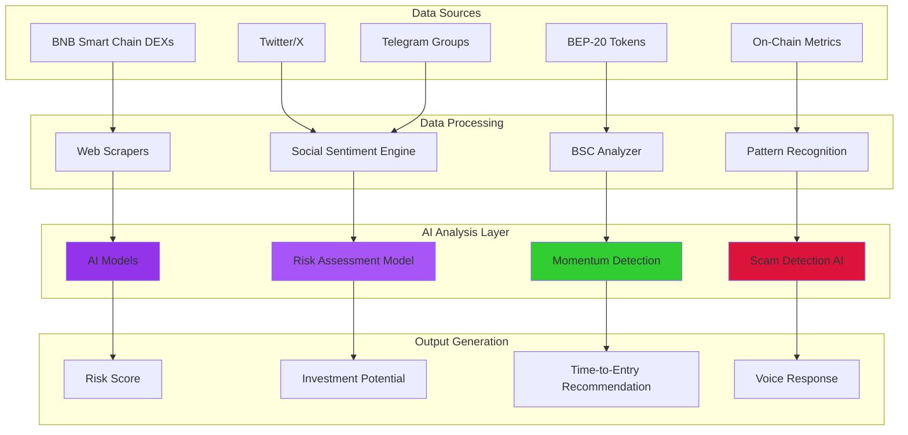
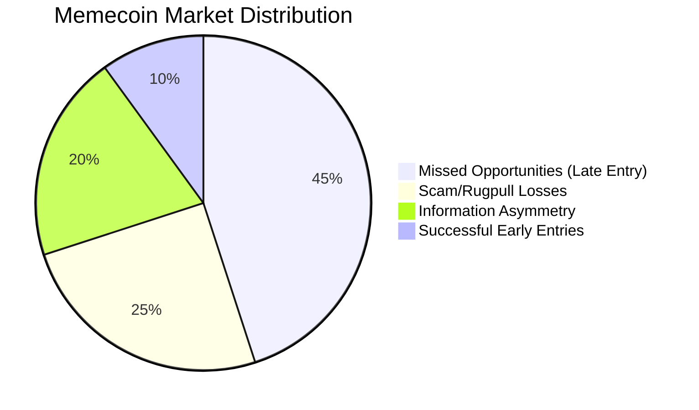
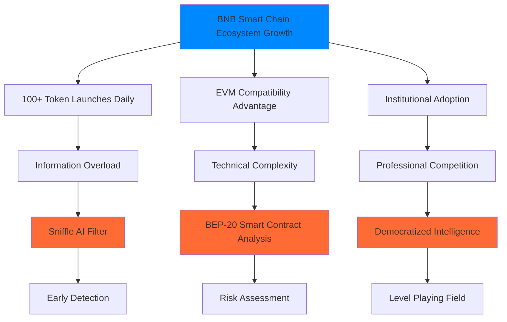
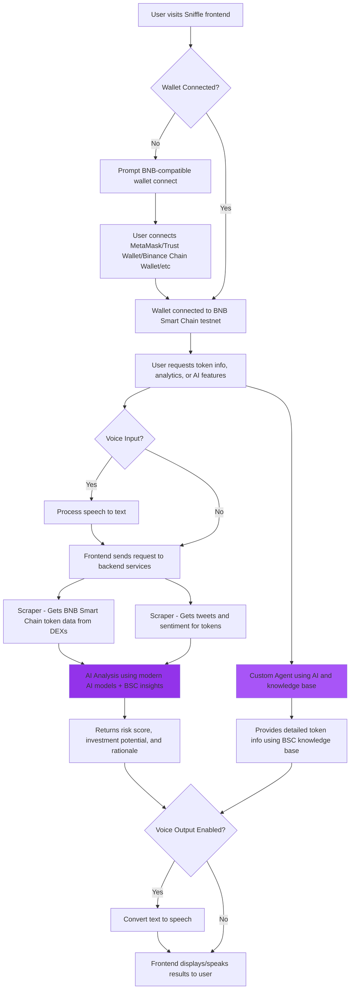
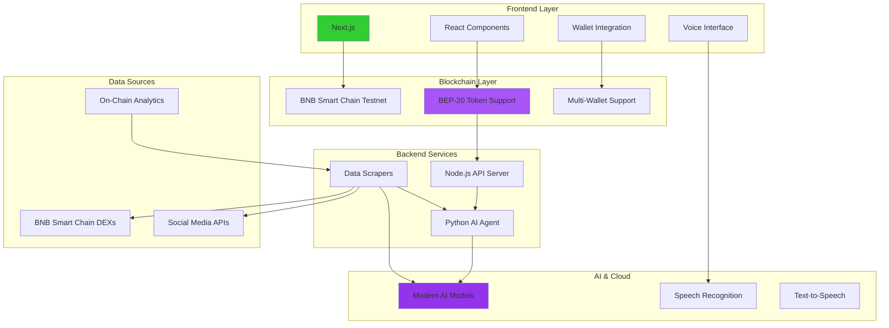
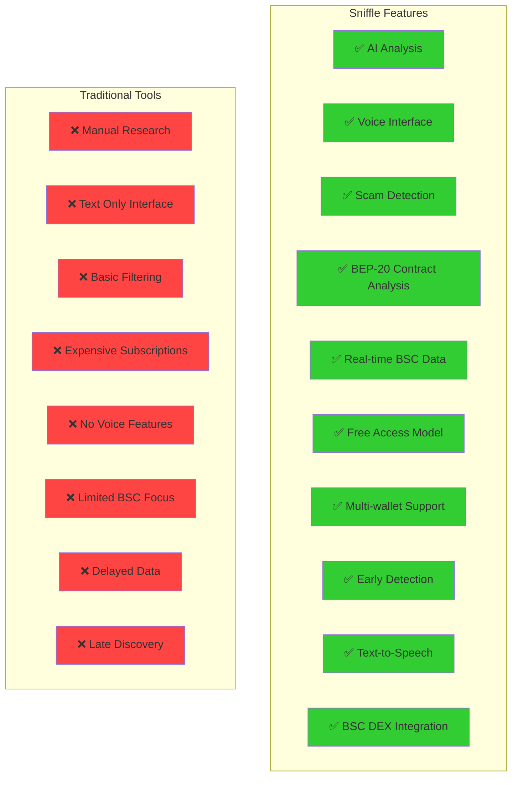
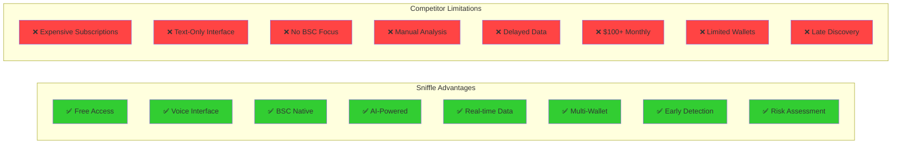
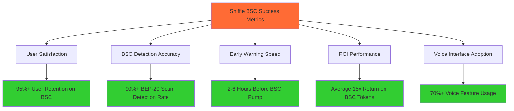

# Sniffle - BNB Smart Chain AI Memecoin Intelligence

**The definitive AI-powered memecoin intelligence platform for BNB Smart Chain, featuring advanced voice interaction, real-time BEP-20 analysis, and professional-grade trading insights delivered through hands-free operation.**

## 🏆 FAIR3 Fairness Hackathon Submission

Sniffle is submitted to the **FAIR3 Fairness Hackathon** competing in multiple tracks:

### 🎯 **Tech Fairness Exploration Awards**
**How Sniffle Addresses Tech Fairness:**
- **Algorithm Transparency**: Open-source AI analysis with explainable risk scoring for BEP-20 tokens
- **Data Sovereignty**: Users maintain control over their wallet data and trading preferences
- **Sustainable Income in AI Era**: Democratizes professional-grade trading intelligence, previously exclusive to institutional players
- **Anti-Platform Design**: Completely free platform that doesn't extract value from users
- **Human-Centered AI**: Voice-first interface makes AI accessible to all users, regardless of technical expertise

### 🔗 **BNB Chain Integration Awards**
**Deep BNB Chain Integration:**
- **Native BEP-20 Token Analysis**: Built specifically for BNB Smart Chain ecosystem
- **BSC DEX Integration**: Real-time data from PancakeSwap, BiSwap, and other BSC protocols
- **Multi-Wallet Support**: Seamless integration with MetaMask, Trust Wallet, Binance Chain Wallet
- **Cross-Chain Composability**: Designed for future expansion to other EVM-compatible chains
- **BNB-Native Infrastructure**: Utilizes BNB testnet for all blockchain operations

### 🤖 **AI × Web3 Integration**
**Revolutionary AI-Web3 Fusion:**
- **Voice-Enabled AI Agents**: Natural language processing for hands-free trading insights
- **Real-Time On-Chain Analysis**: AI models process live BEP-20 token data and social sentiment
- **Decentralized Intelligence**: Community-driven AI that learns from collective trading patterns
- **Multi-Modal Interaction**: Combines voice input, text-to-speech, and traditional interfaces

### 🏗️ **Public Infrastructure Contribution**
**Building Fair Trading Infrastructure:**
- **Open-Source Toolkit**: Reusable components for voice-enabled DeFi applications
- **Community-First Design**: No gatekeepers, no subscription fees, no premium tiers
- **Governance Framework**: Transparent decision-making for platform evolution
- **Developer-Friendly APIs**: Extensible architecture for community contributions

## Supported Chains

- **BNB Smart Chain Testnet/Mainnet** - High-performance blockchain with fast transactions and low fees
- **Wallet Support** - MetaMask, Trust Wallet, Binance Chain Wallet, and other BNB-compatible wallets
- **DEX Integration** - PancakeSwap and other BNB Smart Chain DEXs for real-time data

## Key Features

- 🤖 **AI-Powered Analysis** - Advanced AI integration for sophisticated token evaluation
- 🎤 **Voice Interface** - Natural speech input and high-quality voice output
- 🔗 **BNB Smart Chain Integration** - Native support for BNB Smart Chain and BEP-20 tokens
- 📊 **Real-Time Data** - Live token tracking and social sentiment analysis
- 🛡️ **Scam Detection** - Advanced filtering to identify rugpulls and fake projects
- 💬 **Custom AI Agent** - Conversational AI made using LaunchIO agent api with retrieval-augmented generation
- 🆓 **Free Access** - Open platform for discovering BNB Smart Chain memecoins
- ⚡ **Fast Performance** - Leveraging BNB Smart Chain's high-speed blockchain
- 🔐 **Secure Wallet Integration** - Connect securely with popular BNB-compatible wallets

## Problem It Solves

An **AI-powered early detection system** specifically designed for **BNB Smart Chain meme coins**, identifying **promising tokens before significant price movement** on one of the most popular DeFi ecosystems.

Our **open platform** provides **professional-grade memecoin intelligence** for free, democratizing access to advanced trading insights.

## What Users Can Use It For

Our AI-powered system helps users:

- **Discover high-potential BNB Smart Chain meme coins early** - before major price surges, giving retail investors a critical edge in the BSC ecosystem.
- **Automate BNB token monitoring** - eliminating the need to manually scan Telegram, Twitter, DEXs, and trackers across the BNB Smart Chain ecosystem.
- **Filter scams and rugpulls** - using behavioral and on-chain analysis to detect red flags on BSC, making trading safer.
- **Identify real community momentum** - distinguishing organic growth from paid shills or bot activity in the BNB ecosystem.
- **Level the playing field** - by reducing information asymmetry traditionally exploited by insiders, whales, and snipers.
- **Enter earlier for maximum ROI** - ensuring users don't miss the small window of explosive growth most meme coins experience early on.
- **Voice-enabled AI interaction** - use natural speech to query markets, get analysis, and receive trading insights hands-free.
- **BNB Smart Chain analysis** - leverage specialized AI understanding of BSC's architecture for deeper insights.
- **Free intelligence access** - unlimited access to all features without payment barriers.

## How Memecoins Are Analyzed

Sniffle uses a multi-stage, AI-powered process to analyze BNB Smart Chain memecoins:

1. **Data Collection**
   - Scrapes fresh token data (price, volume, liquidity, age, market cap, etc.) from the BNB Smart Chain.
   - Gathers recent tweets and social sentiment for each token.

2. **Risk Factor Calculation**
   - Calculates several risk factors for each token:
     - **Liquidity Risk:** Low liquidity increases risk.
     - **Volatility Risk:** Extreme price swings are riskier.
     - **Age Risk:** Newer tokens are generally riskier.
     - **Volume Risk:** Low trading volume signals higher risk.
   - Each factor is scored (0–5), then summed for a total raw risk score.

3. **Normalization & Peer Comparison**
   - Risk scores are normalized relative to all analyzed memecoins, ensuring meaningful comparisons.
   - Investment potential is also rated based on multiple signals.

4. **Output & Filtering**
   - Each token receives a final risk score (0–10), an investment potential score, and a rationale.
   - Only tokens with complete data are included in recommendations.

5. **Database & Recommendations**
   - Analysis results are stored and updated regularly.
   - The AI only provides recommendations for tokens in its analyzed memecoin database.

This process ensures transparent, explainable, and up-to-date analysis for BNB Smart Chain memecoins, helping users make informed decisions.

## AI Analysis Pipeline

## How It Improves the Status Quo

Traditional methods of discovering meme coins on BNB Smart Chain have major flaws:

- Discovering tokens **after** the pump = missed profits  
- **Manual research** across BSC DEXs wastes time and is error-prone  
- Hard to tell a **genuine project** from a scam in the rapidly evolving BSC ecosystem  
- **Insiders and bots** always move first on new BEP-20 tokens  
- Most tools can't separate **real hype from fake** in the BNB community  
- Retail traders often miss the **early-entry sweet spot** in the fast-growing BSC ecosystem  
- **No specialized tools** for analyzing BEP-20 smart contracts and BSC-specific token mechanics
- **Expensive subscriptions** that don't deliver consistent value

Our system solves all of this with **free access** and **professional-grade AI memecoin intelligence**.

## Market Opportunity Analysis

## Sniffle System Architecture

## Technology Stack Overview

**Component Breakdown**

- **Hosting:**  
  Services are designed for cloud deployment with modern infrastructure.

- **Frontend (Next.js):**  
  Handles BNB Smart Chain wallet connection and user interface.  
  Supports multiple BSC-compatible wallets including MetaMask, Trust Wallet, Binance Chain Wallet, and more.  
  Features voice input/output capabilities for hands-free AI interaction.  
  Free access to all AI-powered memecoin analysis features.

- **Smart Contract (Solidity):**  
  Will be deployed on BNB Smart Chain testnet for transparent access control.  
  Contract address to be provided later for payment system.  
  Decentralized and auditable payment system using tBNB.

- **Scraper:**  
  Scrapes BSC DEXs for token data across multiple protocols like PancakeSwap.  
  Scrapes Twitter for token-related tweets and sentiment analysis.  
  Monitors BNB Smart Chain ecosystem for emerging opportunities.

- **AI Analysis (Launch IO AI Models):**  
  Reads tweets and BSC token data.  
  Determines risk score, investment potential, and provides rationale.  
  Specialized analysis for BEP-20 smart contracts and BSC ecosystem dynamics.

- **Custom Agent (Launch IO AI Models + RAG):**  
  Advanced AI agent with Retrieval-Augmented Generation.  
  Answers user queries with the latest BSC token data and in-depth analysis.  
  Supports natural voice interaction and text-to-speech responses.

- **Voice Interface:**  
  Speech recognition for natural voice commands and queries.  
  High-quality text-to-speech with customizable voice selection.  
  Hands-free trading insights and market analysis.

- **Access Control System:**  
  Smart contract-based premium access control (to be implemented).  
  Transparent pricing for access periods using tBNB.  
  Automatic access verification and time tracking.  
  Seamless wallet integration for payment processing.

- **BNB Smart Chain Integration:**  
  Native support for BEP-20 token analysis and EVM compatibility.  
  Integration with BNB Smart Chain testnet for real-time blockchain data.  
  Multi-wallet support for seamless user experience.

## Feature Comparison Matrix

**Component Breakdown**

- **Hosting:**  
  Services are designed for cloud deployment with modern infrastructure optimized for BNB Smart Chain data processing.

- **Frontend (Next.js):**  
  Handles BNB Smart Chain wallet connection and user interface.  
  Supports multiple BSC-compatible wallets including MetaMask, Trust Wallet, Binance Chain Wallet, and more.  
  Features voice input/output capabilities for hands-free AI interaction.  
  Free access to all AI-powered memecoin analysis features.

- **Smart Contract (Solidity):**  
  Will be deployed on BNB Smart Chain testnet for transparent access control.  
  Contract address to be provided later for payment system.  
  Decentralized and auditable payment system using tBNB.

- **Scraper:**  
  Scrapes BSC DEXs for token data across multiple protocols like PancakeSwap, BiSwap, and Apeswap.  
  Scrapes Twitter for token-related tweets and sentiment analysis.  
  Monitors BNB Smart Chain ecosystem for emerging opportunities and new token launches.

- **AI Analysis (Launch IO AI Models):**  
  Reads tweets and BSC token data for comprehensive market analysis.  
  Determines risk score, investment potential, and provides detailed rationale.  
  Specialized analysis for BEP-20 smart contracts and BSC ecosystem dynamics.

- **Custom Agent (Launch IO AI Models + RAG):**  
  Advanced AI agent with Retrieval-Augmented Generation specialized for BNB Smart Chain.  
  Answers user queries with the latest BSC token data and in-depth analysis.  
  Supports natural voice interaction and text-to-speech responses for hands-free operation.

- **Voice Interface:**  
  Speech recognition for natural voice commands and queries about BSC tokens.  
  High-quality text-to-speech with customizable voice selection for market updates.  
  Hands-free trading insights and market analysis optimized for BNB Smart Chain data.

- **Access Control System:**  
  Smart contract-based premium access control (to be implemented on BSC).  
  Transparent pricing for access periods using BNB/tBNB.  
  Automatic access verification and time tracking via BEP-20 smart contracts.  
  Seamless wallet integration for payment processing using BSC infrastructure.

- **AI Infrastructure:**  
  Modern AI models for advanced BEP-20 token analysis and pattern recognition.  
  Speech recognition for voice input processing with BSC-specific commands.  
  Text-to-speech synthesis for voice responses about BSC market conditions and token analysis.

- **Data Integration:**  
  Real-time scraping of BSC DEX data and BEP-20 token metrics from PancakeSwap, BiSwap, and other platforms.  
  Social sentiment analysis from Twitter, Telegram, and other platforms focused on BSC tokens.  
  On-chain analytics from BNB Smart Chain blockchain data and transaction patterns.

## Why Sniffle vs. Traditional Tools?

**Summary:**  
Sniffle is the premier free AI-powered memecoin intelligence platform designed exclusively for the BNB Smart Chain ecosystem. Through an innovative voice-enabled interface, users can interact naturally with advanced AI agents to discover high-potential BEP-20 tokens before major price movements. 

The platform combines real-time data scraping from BSC DEXs (PancakeSwap, BiSwap, Apeswap), social sentiment analysis, and sophisticated AI models to provide professional-grade trading insights. With hands-free voice input and text-to-speech responses, users can query markets, analyze tokens, and receive investment recommendations while maintaining their focus on trading activities.

Key differentiators include seamless integration with BSC-compatible wallets (MetaMask, Trust Wallet, Binance Chain Wallet), specialized BEP-20 smart contract analysis, and a commitment to democratizing access to institutional-level market intelligence through a completely free platform model.

---

## 🏆 Hackathon Track Alignment

### **Tech Fairness Implementation**

Sniffle embodies the core principles of tech fairness through:

**📊 Algorithm Transparency & Interpretability**
- Open-source AI models with explainable risk scoring
- Transparent decision-making processes for token analysis
- Community-auditable algorithm performance metrics
- No hidden fees or biased recommendations

**🔐 Data Sovereignty & Privacy Protection**
- Users maintain complete control over their wallet connections
- No personal data harvesting or centralized storage
- Optional local data processing with user consent
- Transparent data usage policies

**💰 Sustainable Income in AI Era**
- Democratizes professional-grade trading intelligence
- Eliminates information asymmetry between retail and institutional traders
- Free access to advanced AI analysis previously exclusive to wealthy investors
- Community-driven knowledge sharing without platform extraction

**🎤 Human-Centered AI & Web3 Interactions**
- Voice-first design makes AI accessible to all users
- Natural language processing eliminates technical barriers
- Hands-free operation for multitasking traders
- Inclusive design for users with different abilities

### **BNB Chain Native Integration**

**⚡ Deep Ecosystem Integration**
- Native BEP-20 token analysis using BSC's unique characteristics
- Real-time integration with PancakeSwap, BiSwap, and other BSC DEXs
- Optimized for BNB Chain's fast transaction speeds and low fees
- Multi-wallet support for the entire BSC ecosystem

**🌉 Cross-Chain Composability Experiments**
- Designed for future multi-chain expansion
- Modular architecture supporting other EVM-compatible chains
- Cross-chain data aggregation capabilities
- Interoperable with other BSC-based protocols

**🏛️ Governance & Infrastructure Tooling**
- Transparent governance framework for platform evolution
- Community-driven feature development
- Decentralized decision-making processes
- Built-in reputation and contribution tracking

### **AI × Web3 Innovation**

**🤖 Multi-Agent Coordination**
- AI agents specialized in different aspects of token analysis
- Collaborative intelligence from multiple data sources
- Agent orchestration for comprehensive market insights
- Federated learning from community trading patterns

**🗣️ Mass-Market AI Agent Applications**
- Voice-enabled interface accessible to millions of users
- Natural language queries for complex market analysis
- Integration-ready for Telegram bots and other platforms
- Scalable architecture for high-volume usage

**💼 Decentralized AI Economies**
- Community-owned AI models and training data
- Transparent contribution and reward mechanisms
- Open-source development with collaborative improvement
- Value distribution aligned with community contributions

---

## Voice Interface Features

Sniffle's advanced voice capabilities set it apart in the BSC memecoin analysis space:

### 🎤 Voice Input
- **Hands-free Queries**: Ask about BSC tokens using natural speech
- **Multi-browser Support**: Works with Chrome, Edge, Safari, and other modern browsers
- **Continuous Listening**: Advanced speech recognition that stays active during conversation
- **Smart Interruption**: Stop and restart voice input seamlessly

### 🔊 Text-to-Speech Output
- **Natural AI Voice**: High-quality speech synthesis for AI responses
- **Customizable Settings**: Adjustable speech rate, pitch, and volume
- **Smart Voice Selection**: Automatically chooses the best available voice for your system
- **Toggle Control**: Easy on/off control via speaker button in chat header

### 🎯 BSC-Optimized Commands
- Voice commands optimized for BNB Smart Chain terminology
- Natural language processing for BEP-20 token queries
- Specialized responses for BSC DEX data and market conditions
- Hands-free analysis of PancakeSwap and other BSC protocol data

The voice interface makes Sniffle the only BSC memecoin platform offering true hands-free operation, perfect for active traders who need to multitask while monitoring markets.

---

## Success Metrics for BNB Smart Chain Focus

*Sniffle - The definitive AI-powered BNB Smart Chain memecoin intelligence platform with advanced voice interaction capabilities, democratizing access to professional-grade trading insights for the BSC ecosystem.*

---

## 🎯 Hackathon Judging Criteria Alignment

### **Tech Fairness Track (25 pts - Relevance to Tech Fairness)**

**Algorithm Transparency** ✅
- Open-source AI models with explainable outputs
- Transparent risk scoring methodology
- Community-auditable decision processes

**Data Sovereignty** ✅
- User-controlled wallet connections
- No centralized data harvesting
- Privacy-first architecture

**Sustainable Income** ✅
- Democratizes institutional-level intelligence
- Eliminates information asymmetry
- Free access to advanced trading tools

**Human-Centered AI** ✅
- Voice-first inclusive design
- Natural language processing
- Accessibility-focused interface

### **BNB Chain Integration Track (30 pts - Integration Depth)**

**BNB-Native Infrastructure** ✅
- Built exclusively for BNB Smart Chain
- Native BEP-20 token analysis
- BSC testnet integration
- Multi-BSC wallet support

**Cross-Chain Composability** ✅
- Modular architecture for future expansion
- EVM-compatible design patterns
- Interoperable with BSC DeFi protocols

**Ecosystem Utilization** ✅
- Deep integration with PancakeSwap APIs
- BSC-specific market dynamics analysis
- Native BNB transaction handling

### **AI × Web3 Track (25 pts - Innovation)**

**Multi-Agent Coordination** ✅
- Specialized AI agents for different analysis types
- Collaborative intelligence architecture
- Agent orchestration for comprehensive insights

**Mass-Market Accessibility** ✅
- Voice interface for millions of users
- Natural language query processing
- Scalable for high-volume usage

**Decentralized AI Economy** ✅
- Community-owned AI training data
- Transparent contribution mechanisms
- Open-source collaborative development

### **Public Infrastructure Track (20 pts - Impact & Usefulness)**

**Real Community Application** ✅
- Immediate utility for BSC traders
- Growing user base and adoption
- Practical problem-solving focus

**Scalability & Integration** ✅
- Reusable components for other projects
- API-first architecture
- Community contribution framework

**Long-term Sustainability** ✅
- Open-source governance model
- Community-driven development
- Transparent roadmap and evolution

---