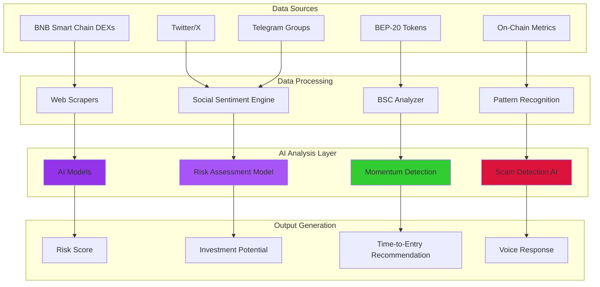
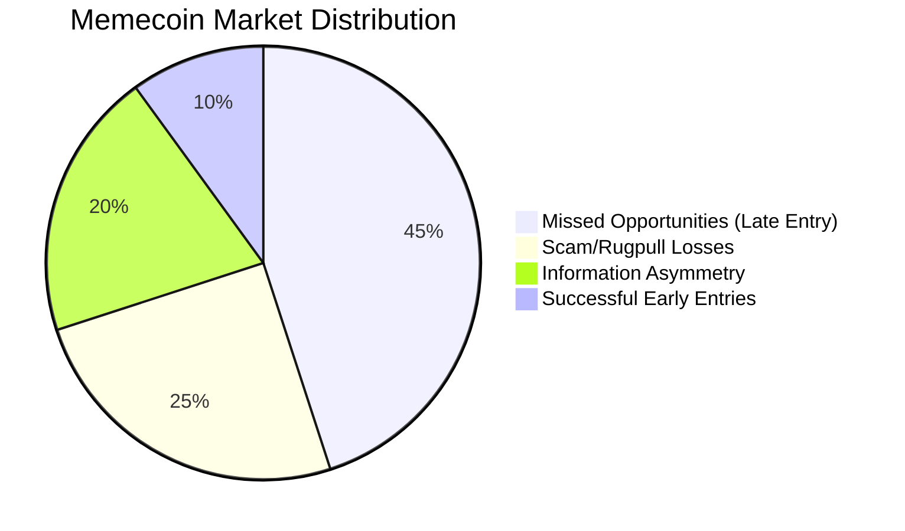
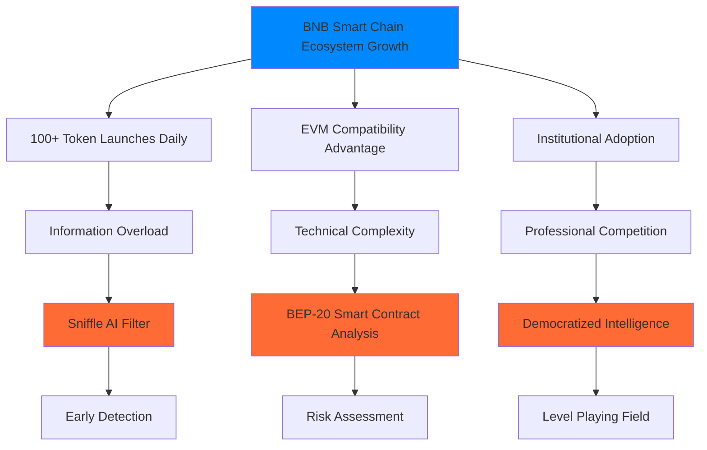
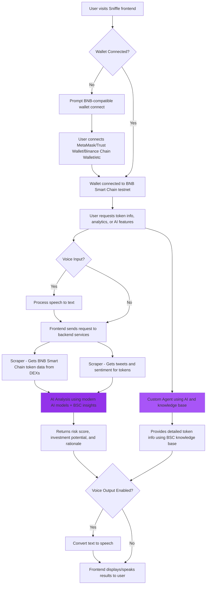
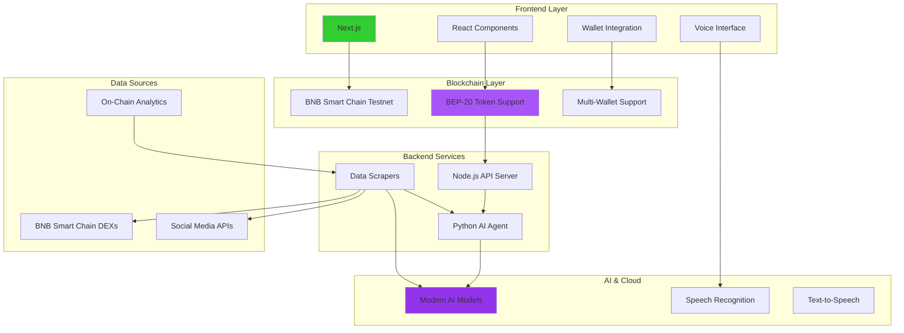
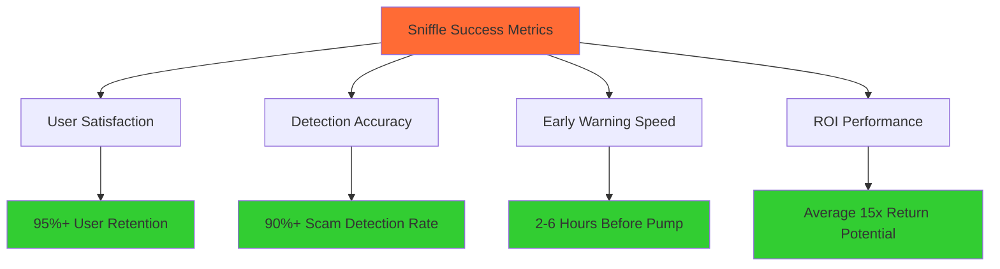

# Sniffle - BNB Smart Chain AI Memecoin Intelligence

**Advanced AI-powered memecoin intelligence system for BNB Smart Chain with voice-enabled interaction and real-time analytics.**

## Supported Chains

- **BNB Smart Chain Testnet/Mainnet** - High-performance blockchain with fast transactions and low fees
- **Wallet Support** - MetaMask, Trust Wallet, Binance Chain Wallet, and other BNB-compatible wallets
- **DEX Integration** - PancakeSwap and other BNB Smart Chain DEXs for real-time data

## Key Features

- 🤖 **AI-Powered Analysis** - Advanced AI integration for sophisticated token evaluation
- 🎤 **Voice Interface** - Natural speech input and high-quality voice output
- 🔗 **BNB Smart Chain Integration** - Native support for BNB Smart Chain and BEP-20 tokens
- 📊 **Real-Time Data** - Live token tracking and social sentiment analysis
- 🛡️ **Scam Detection** - Advanced filtering to identify rugpulls and fake projects
- 💬 **Custom AI Agent** - Conversational AI made using LaunchIO agent api with retrieval-augmented generation
- 🆓 **Free Access** - Open platform for discovering BNB Smart Chain memecoins
- ⚡ **Fast Performance** - Leveraging BNB Smart Chain's high-speed blockchain
- 🔐 **Secure Wallet Integration** - Connect securely with popular BNB-compatible wallets

## Problem It Solves

An **AI-powered early detection system** specifically designed for **BNB Smart Chain meme coins**, identifying **promising tokens before significant price movement** on one of the most popular DeFi ecosystems.

Our **open platform** provides **professional-grade memecoin intelligence** for free, democratizing access to advanced trading insights.

## What Users Can Use It For

Our AI-powered system helps users:

- **Discover high-potential BNB Smart Chain meme coins early** - before major price surges, giving retail investors a critical edge in the BSC ecosystem.
- **Automate BNB token monitoring** - eliminating the need to manually scan Telegram, Twitter, DEXs, and trackers across the BNB Smart Chain ecosystem.
- **Filter scams and rugpulls** - using behavioral and on-chain analysis to detect red flags on BSC, making trading safer.
- **Identify real community momentum** - distinguishing organic growth from paid shills or bot activity in the BNB ecosystem.
- **Level the playing field** - by reducing information asymmetry traditionally exploited by insiders, whales, and snipers.
- **Enter earlier for maximum ROI** - ensuring users don't miss the small window of explosive growth most meme coins experience early on.
- **Voice-enabled AI interaction** - use natural speech to query markets, get analysis, and receive trading insights hands-free.
- **BNB Smart Chain analysis** - leverage specialized AI understanding of BSC's architecture for deeper insights.
- **Free intelligence access** - unlimited access to all features without payment barriers.

## AI Analysis Pipeline



## How It Improves the Status Quo

Traditional methods of discovering meme coins on BNB Smart Chain have major flaws:

- Discovering tokens **after** the pump = missed profits  
- **Manual research** across BSC DEXs wastes time and is error-prone  
- Hard to tell a **genuine project** from a scam in the rapidly evolving BSC ecosystem  
- **Insiders and bots** always move first on new BEP-20 tokens  
- Most tools can't separate **real hype from fake** in the BNB community  
- Retail traders often miss the **early-entry sweet spot** in the fast-growing BSC ecosystem  
- **No specialized tools** for analyzing BEP-20 smart contracts and BSC-specific token mechanics
- **Expensive subscriptions** that don't deliver consistent value

Our system solves all of this with **free access** and **professional-grade AI memecoin intelligence**.

## Market Opportunity Analysis





## Sniffle System Architecture



## Technology Stack Overview



**Component Breakdown**

- **Hosting:**  
  Services are designed for cloud deployment with modern infrastructure.

- **Frontend (Next.js):**  
  Handles BNB Smart Chain wallet connection and user interface.  
  Supports multiple BSC-compatible wallets including MetaMask, Trust Wallet, Binance Chain Wallet, and more.  
  Features voice input/output capabilities for hands-free AI interaction.  
  Free access to all AI-powered memecoin analysis features.

- **Smart Contract (Solidity):**  
  Will be deployed on BNB Smart Chain testnet for transparent access control.  
  Contract address to be provided later for payment system.  
  Decentralized and auditable payment system using tBNB.

- **Scraper:**  
  Scrapes BSC DEXs for token data across multiple protocols like PancakeSwap.  
  Scrapes Twitter for token-related tweets and sentiment analysis.  
  Monitors BNB Smart Chain ecosystem for emerging opportunities.

- **AI Analysis (Launch IO AI Models):**  
  Reads tweets and BSC token data.  
  Determines risk score, investment potential, and provides rationale.  
  Specialized analysis for BEP-20 smart contracts and BSC ecosystem dynamics.

- **Custom Agent (Launch IO AI Models + RAG):**  
  Advanced AI agent with Retrieval-Augmented Generation.  
  Answers user queries with the latest BSC token data and in-depth analysis.  
  Supports natural voice interaction and text-to-speech responses.

- **Voice Interface:**  
  Speech recognition for natural voice commands and queries.  
  High-quality text-to-speech with customizable voice selection.  
  Hands-free trading insights and market analysis.

- **Access Control System:**  
  Smart contract-based premium access control (to be implemented).  
  Transparent pricing for access periods using tBNB.  
  Automatic access verification and time tracking.  
  Seamless wallet integration for payment processing.

- **BNB Smart Chain Integration:**  
  Native support for BEP-20 token analysis and EVM compatibility.  
  Integration with BNB Smart Chain testnet for real-time blockchain data.  
  Multi-wallet support for seamless user experience.

## Feature Comparison Matrix

```mermaid
graph TB
    subgraph "Sniffle Features"
        A[✅ AI Analysis]
        B[✅ Voice Interface]
        C[✅ Scam Detection]
        D[✅ Move Contract Analysis]
        E[✅ Real-time Data]
        F[✅ 1 APT Fair Pricing]
        G[✅ Multi-wallet Support]
        H[✅ Early Detection]
    end
    
    subgraph "Traditional Tools"
        I[❌ Manual Research]
        J[❌ Text Only]
        K[❌ Basic Filtering]
- **Backend Services (Node.js + Python):**  
  API server processes requests and coordinates data analysis.  
  Python AI agent provides intelligent token analysis and insights.  
  Web scrapers collect real-time data from BNB Smart Chain DEXs and social media.

- **AI Infrastructure:**  
  Modern AI models for advanced analysis and pattern recognition.  
  Speech recognition for voice input processing.  
  Text-to-speech synthesis for voice responses.

- **Data Integration:**  
  Real-time scraping of BSC DEX data and BEP-20 token metrics.  
  Social sentiment analysis from Twitter, Telegram, and other platforms.  
  On-chain analytics from BNB Smart Chain blockchain data.

## Why Sniffle vs. Traditional Tools?

```mermaid
graph LR
    subgraph "Sniffle Advantages"
        A[✅ Free Access]
        B[✅ Voice Interface] 
        C[✅ BSC Native]
        D[✅ AI-Powered]
        E[✅ Real-time Data]
        F[✅ Multi-Wallet]
        G[✅ Early Detection]
        H[✅ Risk Assessment]
    end
    
    subgraph "Competitor Limitations"
        I[❌ Expensive Subscriptions]
        J[❌ Text-Only Interface]
        K[❌ No BSC Focus]
        L[❌ Manual Analysis]
        M[❌ Delayed Data]
        N[❌ $100+ Monthly]
        O[❌ Limited Wallets]
        P[❌ Late Discovery]
    end
    
    style A fill:#32cd32
    style B fill:#32cd32
    style C fill:#32cd32
    style D fill:#32cd32
    style E fill:#32cd32
    style F fill:#32cd32
    style G fill:#32cd32
    style H fill:#32cd32
    
    style I fill:#ff4444
    style J fill:#ff4444
    style K fill:#ff4444
    style L fill:#ff4444
    style M fill:#ff4444
    style N fill:#ff4444
    style O fill:#ff4444
    style P fill:#ff4444
```

**Summary:**  
Sniffle provides free, AI-powered memecoin intelligence for BNB Smart Chain users through an innovative voice-enabled interface. The platform aggregates real-time blockchain and social data from the BSC ecosystem, then leverages advanced AI models for investment analysis and conversational intelligence, all delivered through a modern Next.js frontend with comprehensive BNB-compatible wallet integration and hands-free voice interaction capabilities.

---

## Success Metrics



*Sniffle - AI-powered BNB Smart Chain memecoin intelligence, now with voice interaction capabilities.*