# Sniffle - BNB Smart Chain AI Memecoin Intelligence

**The definitive AI-powered memecoin intelligence platform for BNB Smart Chain, featuring advanced voice interaction, real-time BEP-20 analysis, and professional-grade trading insights delivered through hands-free operation.**

## Supported Chains

- **BNB Smart Chain Testnet/Mainnet** - High-performance blockchain with fast transactions and low fees
- **Wallet Support** - MetaMask, Trust Wallet, Binance Chain Wallet, and other BNB-compatible wallets
- **DEX Integration** - PancakeSwap and other BNB Smart Chain DEXs for real-time data

## Key Features

- 🤖 **AI-Powered Analysis** - Advanced AI integration for sophisticated token evaluation
- 🎤 **Voice Interface** - Natural speech input and high-quality voice output
- 🔗 **BNB Smart Chain Integration** - Native support for BNB Smart Chain and BEP-20 tokens
- 📊 **Real-Time Data** - Live token tracking and social sentiment analysis
- 🛡️ **Scam Detection** - Advanced filtering to identify rugpulls and fake projects
- 💬 **Custom AI Agent** - Conversational AI made using LaunchIO agent api with retrieval-augmented generation
- 🆓 **Free Access** - Open platform for discovering BNB Smart Chain memecoins
- ⚡ **Fast Performance** - Leveraging BNB Smart Chain's high-speed blockchain
- 🔐 **Secure Wallet Integration** - Connect securely with popular BNB-compatible wallets

## Problem It Solves

An **AI-powered early detection system** specifically designed for **BNB Smart Chain meme coins**, identifying **promising tokens before significant price movement** on one of the most popular DeFi ecosystems.

Our **open platform** provides **professional-grade memecoin intelligence** for free, democratizing access to advanced trading insights.

## What Users Can Use It For

Our AI-powered system helps users:

- **Discover high-potential BNB Smart Chain meme coins early** - before major price surges, giving retail investors a critical edge in the BSC ecosystem.
- **Automate BNB token monitoring** - eliminating the need to manually scan Telegram, Twitter, DEXs, and trackers across the BNB Smart Chain ecosystem.
- **Filter scams and rugpulls** - using behavioral and on-chain analysis to detect red flags on BSC, making trading safer.
- **Identify real community momentum** - distinguishing organic growth from paid shills or bot activity in the BNB ecosystem.
- **Level the playing field** - by reducing information asymmetry traditionally exploited by insiders, whales, and snipers.
- **Enter earlier for maximum ROI** - ensuring users don't miss the small window of explosive growth most meme coins experience early on.
- **Voice-enabled AI interaction** - use natural speech to query markets, get analysis, and receive trading insights hands-free.
- **BNB Smart Chain analysis** - leverage specialized AI understanding of BSC's architecture for deeper insights.
- **Free intelligence access** - unlimited access to all features without payment barriers.

## AI Analysis Pipeline

## How It Improves the Status Quo

Traditional methods of discovering meme coins on BNB Smart Chain have major flaws:

- Discovering tokens **after** the pump = missed profits  
- **Manual research** across BSC DEXs wastes time and is error-prone  
- Hard to tell a **genuine project** from a scam in the rapidly evolving BSC ecosystem  
- **Insiders and bots** always move first on new BEP-20 tokens  
- Most tools can't separate **real hype from fake** in the BNB community  
- Retail traders often miss the **early-entry sweet spot** in the fast-growing BSC ecosystem  
- **No specialized tools** for analyzing BEP-20 smart contracts and BSC-specific token mechanics
- **Expensive subscriptions** that don't deliver consistent value

Our system solves all of this with **free access** and **professional-grade AI memecoin intelligence**.

## Market Opportunity Analysis

## Sniffle System Architecture

## Technology Stack Overview

**Component Breakdown**

- **Hosting:**  
  Services are designed for cloud deployment with modern infrastructure.

- **Frontend (Next.js):**  
  Handles BNB Smart Chain wallet connection and user interface.  
  Supports multiple BSC-compatible wallets including MetaMask, Trust Wallet, Binance Chain Wallet, and more.  
  Features voice input/output capabilities for hands-free AI interaction.  
  Free access to all AI-powered memecoin analysis features.

- **Smart Contract (Solidity):**  
  Will be deployed on BNB Smart Chain testnet for transparent access control.  
  Contract address to be provided later for payment system.  
  Decentralized and auditable payment system using tBNB.

- **Scraper:**  
  Scrapes BSC DEXs for token data across multiple protocols like PancakeSwap.  
  Scrapes Twitter for token-related tweets and sentiment analysis.  
  Monitors BNB Smart Chain ecosystem for emerging opportunities.

- **AI Analysis (Launch IO AI Models):**  
  Reads tweets and BSC token data.  
  Determines risk score, investment potential, and provides rationale.  
  Specialized analysis for BEP-20 smart contracts and BSC ecosystem dynamics.

- **Custom Agent (Launch IO AI Models + RAG):**  
  Advanced AI agent with Retrieval-Augmented Generation.  
  Answers user queries with the latest BSC token data and in-depth analysis.  
  Supports natural voice interaction and text-to-speech responses.

- **Voice Interface:**  
  Speech recognition for natural voice commands and queries.  
  High-quality text-to-speech with customizable voice selection.  
  Hands-free trading insights and market analysis.

- **Access Control System:**  
  Smart contract-based premium access control (to be implemented).  
  Transparent pricing for access periods using tBNB.  
  Automatic access verification and time tracking.  
  Seamless wallet integration for payment processing.

- **BNB Smart Chain Integration:**  
  Native support for BEP-20 token analysis and EVM compatibility.  
  Integration with BNB Smart Chain testnet for real-time blockchain data.  
  Multi-wallet support for seamless user experience.

## Feature Comparison Matrix

```mermaid
graph TB
    subgraph "Sniffle Features"
        A[✅ AI Analysis]
        B[✅ Voice Interface]
        C[✅ Scam Detection]
        D[✅ BEP-20 Contract Analysis]
        E[✅ Real-time BSC Data]
        F[✅ Free Access Model]
        G[✅ Multi-wallet Support]
        H[✅ Early Detection]
        I[✅ Text-to-Speech]
        J[✅ BSC DEX Integration]
    end
    
    subgraph "Traditional Tools"
        K[❌ Manual Research]
        L[❌ Text Only Interface]
        M[❌ Basic Filtering]
        N[❌ Expensive Subscriptions]
        O[❌ No Voice Features]
        P[❌ Limited BSC Focus]
        Q[❌ Delayed Data]
        R[❌ Late Discovery]
    end
    
    style A fill:#32cd32
    style B fill:#32cd32
    style C fill:#32cd32
    style D fill:#32cd32
    style E fill:#32cd32
    style F fill:#32cd32
    style G fill:#32cd32
    style H fill:#32cd32
    style I fill:#32cd32
    style J fill:#32cd32
    
    style K fill:#ff4444
    style L fill:#ff4444
    style M fill:#ff4444
    style N fill:#ff4444
    style O fill:#ff4444
    style P fill:#ff4444
    style Q fill:#ff4444
    style R fill:#ff4444
```

**Component Breakdown**

- **Hosting:**  
  Services are designed for cloud deployment with modern infrastructure optimized for BNB Smart Chain data processing.

- **Frontend (Next.js):**  
  Handles BNB Smart Chain wallet connection and user interface.  
  Supports multiple BSC-compatible wallets including MetaMask, Trust Wallet, Binance Chain Wallet, and more.  
  Features voice input/output capabilities for hands-free AI interaction.  
  Free access to all AI-powered memecoin analysis features.

- **Smart Contract (Solidity):**  
  Will be deployed on BNB Smart Chain testnet for transparent access control.  
  Contract address to be provided later for payment system.  
  Decentralized and auditable payment system using tBNB.

- **Scraper:**  
  Scrapes BSC DEXs for token data across multiple protocols like PancakeSwap, BiSwap, and Apeswap.  
  Scrapes Twitter for token-related tweets and sentiment analysis.  
  Monitors BNB Smart Chain ecosystem for emerging opportunities and new token launches.

- **AI Analysis (Launch IO AI Models):**  
  Reads tweets and BSC token data for comprehensive market analysis.  
  Determines risk score, investment potential, and provides detailed rationale.  
  Specialized analysis for BEP-20 smart contracts and BSC ecosystem dynamics.

- **Custom Agent (Launch IO AI Models + RAG):**  
  Advanced AI agent with Retrieval-Augmented Generation specialized for BNB Smart Chain.  
  Answers user queries with the latest BSC token data and in-depth analysis.  
  Supports natural voice interaction and text-to-speech responses for hands-free operation.

- **Voice Interface:**  
  Speech recognition for natural voice commands and queries about BSC tokens.  
  High-quality text-to-speech with customizable voice selection for market updates.  
  Hands-free trading insights and market analysis optimized for BNB Smart Chain data.

- **Access Control System:**  
  Smart contract-based premium access control (to be implemented on BSC).  
  Transparent pricing for access periods using BNB/tBNB.  
  Automatic access verification and time tracking via BEP-20 smart contracts.  
  Seamless wallet integration for payment processing using BSC infrastructure.

- **AI Infrastructure:**  
  Modern AI models for advanced BEP-20 token analysis and pattern recognition.  
  Speech recognition for voice input processing with BSC-specific commands.  
  Text-to-speech synthesis for voice responses about BSC market conditions and token analysis.

- **Data Integration:**  
  Real-time scraping of BSC DEX data and BEP-20 token metrics from PancakeSwap, BiSwap, and other platforms.  
  Social sentiment analysis from Twitter, Telegram, and other platforms focused on BSC tokens.  
  On-chain analytics from BNB Smart Chain blockchain data and transaction patterns.

## Why Sniffle vs. Traditional Tools?

```mermaid
graph LR
    subgraph "Sniffle Advantages"
        A[✅ Free Access]
        B[✅ Voice Interface] 
        C[✅ BSC Native]
        D[✅ AI-Powered]
        E[✅ Real-time Data]
        F[✅ Multi-Wallet]
        G[✅ Early Detection]
        H[✅ Risk Assessment]
    end
    
    subgraph "Competitor Limitations"
        I[❌ Expensive Subscriptions]
        J[❌ Text-Only Interface]
        K[❌ No BSC Focus]
        L[❌ Manual Analysis]
        M[❌ Delayed Data]
        N[❌ $100+ Monthly]
        O[❌ Limited Wallets]
        P[❌ Late Discovery]
    end
    
    style A fill:#32cd32
    style B fill:#32cd32
    style C fill:#32cd32
    style D fill:#32cd32
    style E fill:#32cd32
    style F fill:#32cd32
    style G fill:#32cd32
    style H fill:#32cd32
    
    style I fill:#ff4444
    style J fill:#ff4444
    style K fill:#ff4444
    style L fill:#ff4444
    style M fill:#ff4444
    style N fill:#ff4444
    style O fill:#ff4444
    style P fill:#ff4444
```

**Summary:**  
Sniffle is the premier free AI-powered memecoin intelligence platform designed exclusively for the BNB Smart Chain ecosystem. Through an innovative voice-enabled interface, users can interact naturally with advanced AI agents to discover high-potential BEP-20 tokens before major price movements. 

The platform combines real-time data scraping from BSC DEXs (PancakeSwap, BiSwap, Apeswap), social sentiment analysis, and sophisticated AI models to provide professional-grade trading insights. With hands-free voice input and text-to-speech responses, users can query markets, analyze tokens, and receive investment recommendations while maintaining their focus on trading activities.

Key differentiators include seamless integration with BSC-compatible wallets (MetaMask, Trust Wallet, Binance Chain Wallet), specialized BEP-20 smart contract analysis, and a commitment to democratizing access to institutional-level market intelligence through a completely free platform model.

---

## Voice Interface Features

Sniffle's advanced voice capabilities set it apart in the BSC memecoin analysis space:

### 🎤 Voice Input
- **Hands-free Queries**: Ask about BSC tokens using natural speech
- **Multi-browser Support**: Works with Chrome, Edge, Safari, and other modern browsers
- **Continuous Listening**: Advanced speech recognition that stays active during conversation
- **Smart Interruption**: Stop and restart voice input seamlessly

### 🔊 Text-to-Speech Output
- **Natural AI Voice**: High-quality speech synthesis for AI responses
- **Customizable Settings**: Adjustable speech rate, pitch, and volume
- **Smart Voice Selection**: Automatically chooses the best available voice for your system
- **Toggle Control**: Easy on/off control via speaker button in chat header

### 🎯 BSC-Optimized Commands
- Voice commands optimized for BNB Smart Chain terminology
- Natural language processing for BEP-20 token queries
- Specialized responses for BSC DEX data and market conditions
- Hands-free analysis of PancakeSwap and other BSC protocol data

The voice interface makes Sniffle the only BSC memecoin platform offering true hands-free operation, perfect for active traders who need to multitask while monitoring markets.

---

## Success Metrics for BNB Smart Chain Focus

*Sniffle - The definitive AI-powered BNB Smart Chain memecoin intelligence platform with advanced voice interaction capabilities, democratizing access to professional-grade trading insights for the BSC ecosystem.*